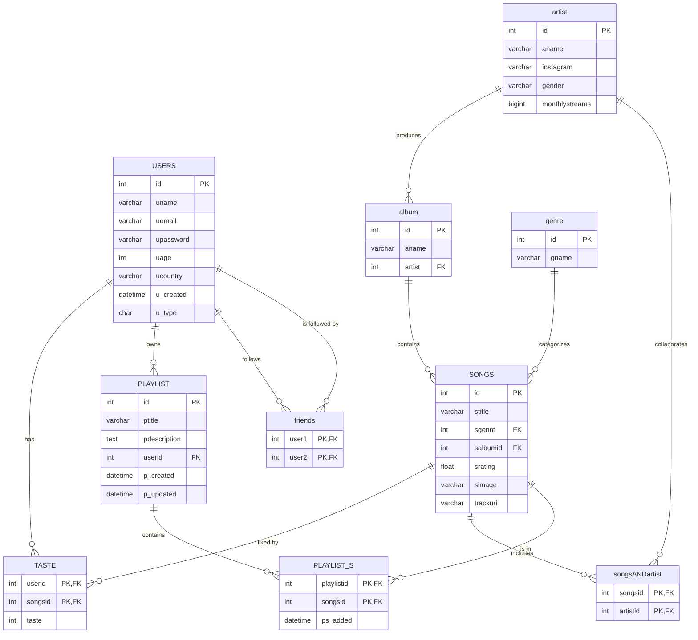

```mermaid
erDiagram
    USERS {
        int id PK
        varchar uname
        varchar uemail
        varchar upassword
        int uage
        varchar ucountry
        datetime u_created
        char u_type
    }

    artist {
        int id PK
        varchar aname
        varchar instagram
        varchar gender
        bigint monthlystreams
    }

    album {
        int id PK
        varchar aname
        int artist FK
    }

    genre {
        int id PK
        varchar gname
    }

    SONGS {
        int id PK
        varchar stitle
        int sgenre FK
        int salbumid FK
        float srating
        varchar simage
        varchar trackuri
    }

    songsANDartist {
        int songsid PK, FK
        int artistid PK, FK
    }

    TASTE {
        int userid PK, FK
        int songsid PK, FK
        int taste
    }

     PLAYLIST {
        int id PK
        varchar ptitle
        text pdescription
        int userid FK
        datetime p_created
        datetime p_updated
    }

    PLAYLIST_S {
        int playlistid PK, FK
        int songsid PK, FK
        datetime ps_added
    }

    friends {
        int user1 PK, FK
        int user2 PK, FK
    }

    USERS ||--o{ TASTE : "has"
    SONGS ||--o{ TASTE : "liked by"
    artist ||--o{ album : "produces"
    genre ||--o{ SONGS : "categorizes"
    album ||--o{ SONGS : "contains"
    artist ||--o{ songsANDartist : "collaborates"
    SONGS ||--o{ songsANDartist : "includes"

    USERS ||--o{ PLAYLIST : "owns"
    PLAYLIST ||--o{ PLAYLIST_S : "contains"
    SONGS ||--o{ PLAYLIST_S : "is in"

    USERS ||--o{ friends : "follows"
    USERS ||--o{ friends : "is followed by"
```
