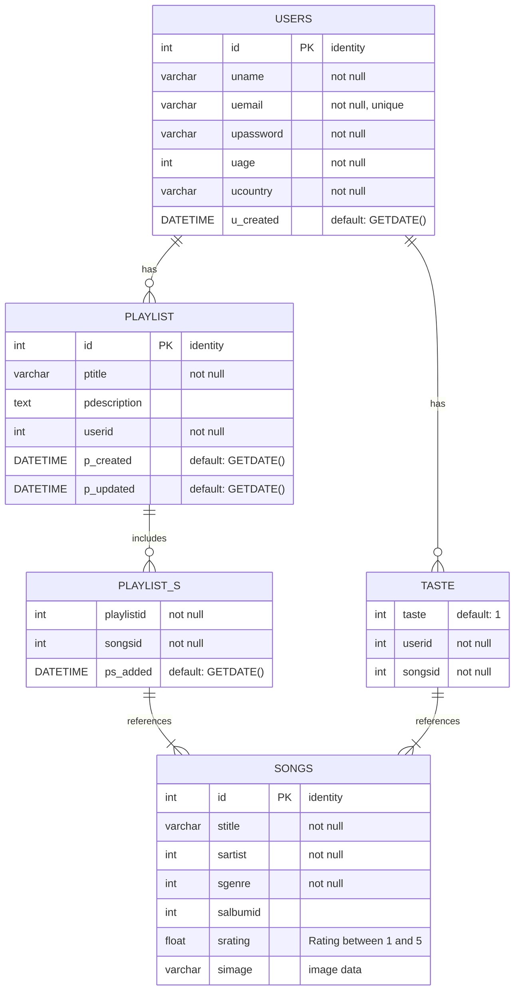

```mermaid
erDiagram
    USERS {
        int id PK "identity"
        varchar uname "not null"
        varchar uemail "not null, unique"
        varchar upassword "not null"
        int uage "not null"
        varchar ucountry "not null"
        DATETIME u_created "default: GETDATE()"
    }

    PLAYLIST {
        int id PK "identity"
        varchar ptitle "not null"
        text pdescription
        int userid "not null"
        DATETIME p_created "default: GETDATE()"
        DATETIME p_updated "default: GETDATE()"
    }

 
    SONGS {
        int id PK "identity"
        varchar stitle "not null"
        int sartist "not null"
        int sgenre "not null"
        int salbumid
        float srating "Rating between 1 and 5"
        varchar simage "image data"
    }

    PLAYLIST_S {
        int playlistid "not null"
        int songsid "not null"
        DATETIME ps_added "default: GETDATE()"
    }

    TASTE {
        int taste "default: 1"
        int userid "not null"
        int songsid "not null"
    }

    USERS ||--o{ PLAYLIST : "has"
    USERS ||--o{ TASTE : "has"
    PLAYLIST ||--o{ PLAYLIST_S : "includes"
    PLAYLIST_S ||--|{ SONGS : "references"
    TASTE ||--|{ SONGS : "references"
```

//ctrl+shift+V